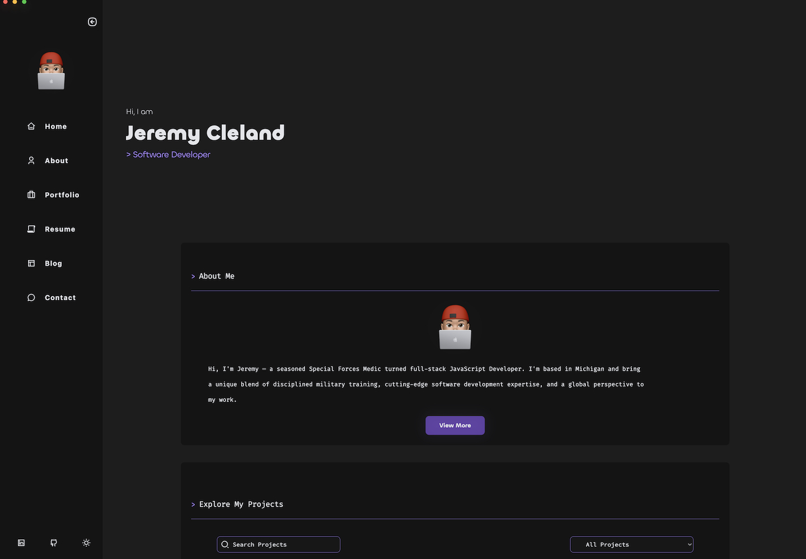
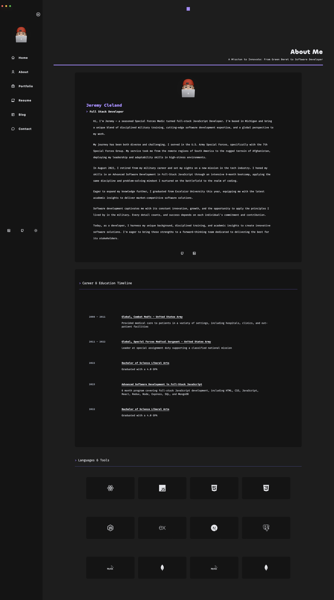
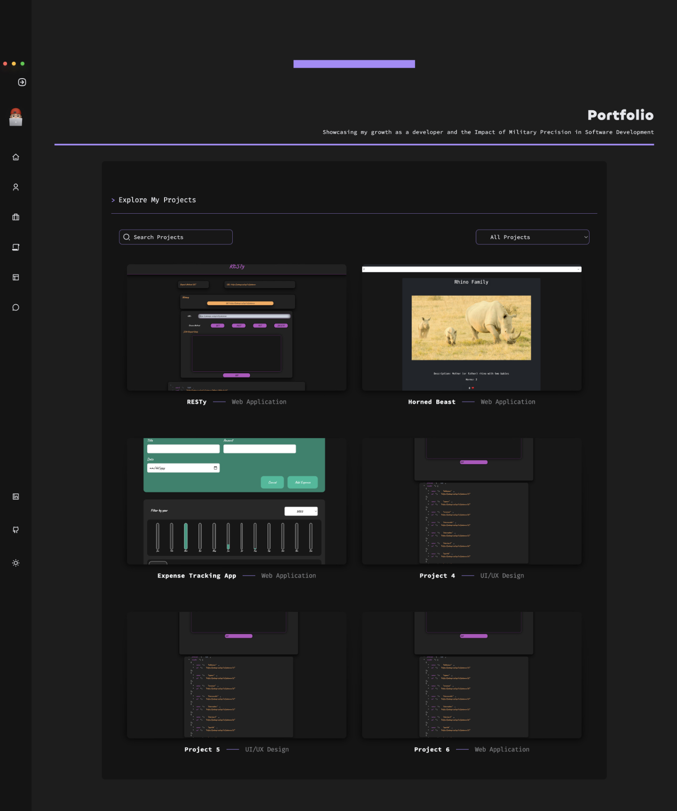
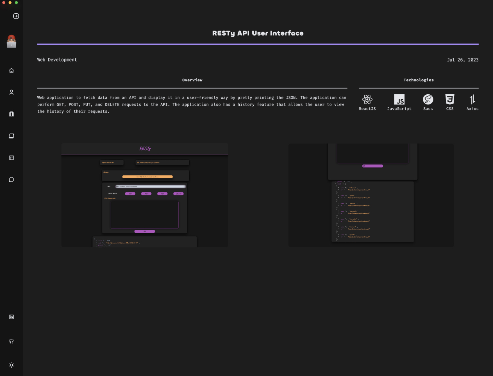
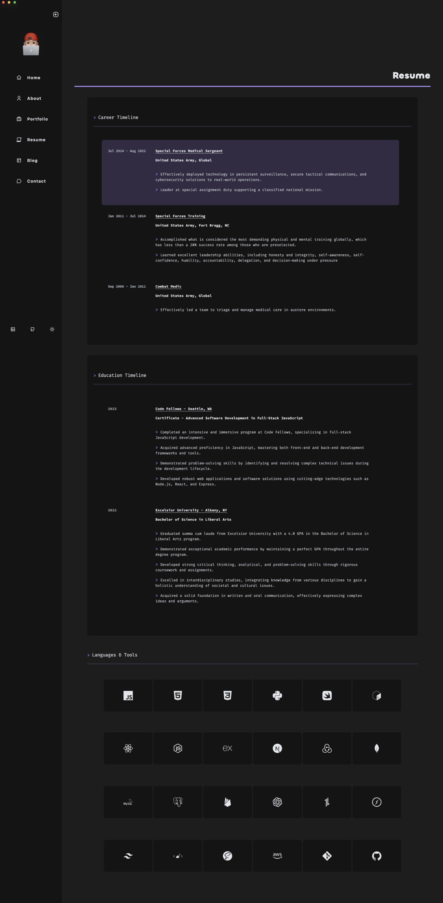
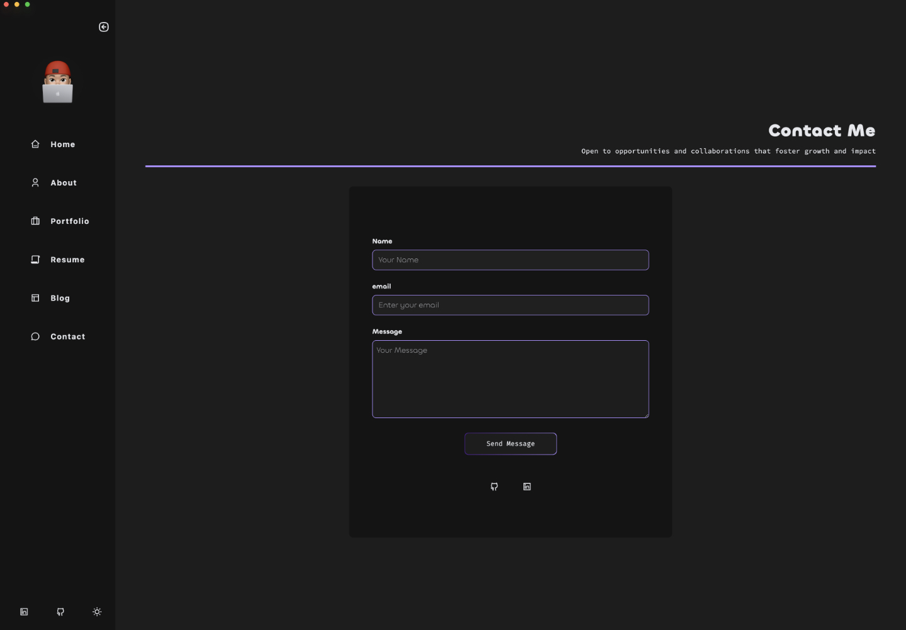
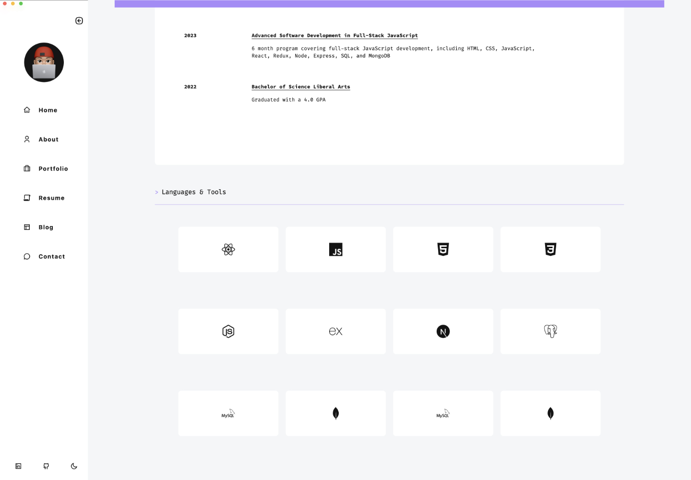

# Jeremy Cleland's Portfolio

A personal portfolio website showcasing Jeremy Cleland's skills, projects, and accomplishments as a software developer. Built with React.js, Tailwind CSS, Framer Motion and Vite and featuring a responsive, user-friendly design.

## Deployed Application

[https://dev.clelandco.com](https://dev.clelandco.com)

[](https://app.netlify.com/sites/jeremy-cleland/deploys)

## Table of Contents

- [Features](#features)
- [Installation](#installation)
- [Usage](#usage)
- [License](#license)
- [More Images](#more-images)
- [Blog Setup](#blog-setup)

## Features

- Responsive design for optimal viewing on various devices.
- Dark and light mode support for user preference.
- Sidebar navigation for easy access to different sections.
- Showcases personal projects with descriptions and live/demo links.
- Resume and contact information available for potential employers.

## Installation

To run this project locally, follow these steps:

1. Clone the repository:

```bash

git clone https://github.com/jeremy-cleland/portfolio.git
cd portfolio

```

1. Install the dependencies:

```bash

npm install
```

1. Start the development server:

```bash

npm run dev

```

1. Open your browser and visit `http://localhost:5173` to view the portfolio.

## Usage

Browse the portfolio sections using the sidebar navigation to learn more about Jeremy's skills, experiences, and projects. Toggle between dark and light modes using the button at the bottom of the sidebar.

## Blog Setup

To set up the blog with WordPress, follow these steps:

1. Install WordPress on your server or use a WordPress hosting provider.
2. Install and activate the WordPress REST API plugin if it's not already included in your WordPress installation.
3. Create some blog posts in your WordPress admin panel.
4. Update the `src/pages/blog/index.jsx` file with your WordPress domain in the `axios.get` URL.
5. Start the development server and navigate to the `/blog` route to see your blog posts.

## License

This project is licensed under the terms of the [MIT](https://opensource.org/licenses/MIT) license.

### More Images

#### Home Page



#### About Page



#### Portfolio Page



### Project Page



#### Resume Page



#### Contact Page



#### Light Mode


