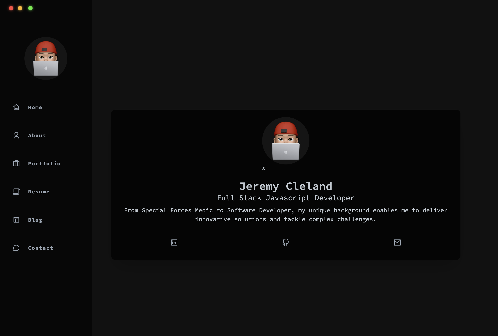

# Jeremy Cleland's Portfolio

A personal portfolio website showcasing Jeremy Cleland's skills, projects, and accomplishments as a software developer. Built with React.js, Tailwind CSS, and featuring a responsive, user-friendly design.



## Table of Contents

- [Features](#features)
- [Installation](#installation)
- [Usage](#usage)

## Features

- Responsive design for optimal viewing on various devices.
- Dark and light mode support for user preference.
- Sidebar navigation for easy access to different sections.
- Showcases personal projects with descriptions and live/demo links.
- Resume and contact information available for potential employers.

## Installation

To run this project locally, follow these steps:

1. Clone the repository:

```bash

git clone https://github.com/jeremy-cleland/portfolio.git
cd portfolio

```

1. Install the dependencies:

```bash

npm install
```

1. Start the development server:

```bash

npm run dev

```

1. Open your browser and visit `http://localhost:5173` to view the portfolio.

## Usage

Browse the portfolio sections using the sidebar navigation to learn more about Jeremy's skills, experiences, and projects. Toggle between dark and light modes using the button at the bottom of the sidebar.
